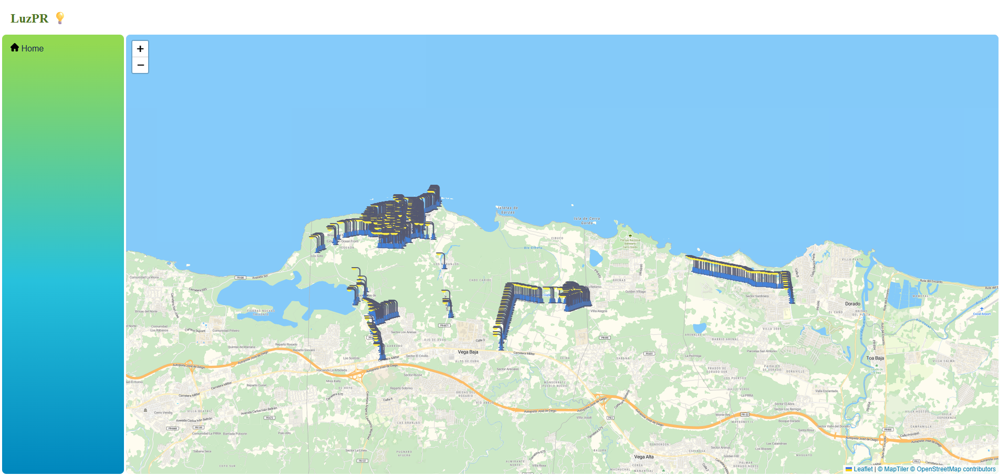

# LuzPR 💡

##  Introduction

LuzPR is an interactive map that displays the location of every light post in Puerto Rico, from Aguadilla to Vieques, and their current operating status. This map would enable users to report on faulty light posts, creating a more direct line between citizens and LUMA.

## Problem

One of the many public facilities that face recurring power outages is our street light posts. This can lead to possible accidents and safety concerns. Currently, one can't report a specific light post since it's not affected by a greater outage.

## Solution

This project aims to map every light post in Puerto Rico that is under the control of LUMA, allowing the user to more accurately and directly report any faulty one. When confirmed that the light post is faulty, it will marked as inactive on the map. The user will then be able to track their report on their page. To avoid false reports, only verified MiLuma account holders can submit them, taking advantage of LUMA's existing authentication process, while the public can still see the overall map.

## Screenshot(s)

**Figure 1: Mock Home Page**

## Tech Stack

- **Frontend:** HTML, CSS, JavaScript, Leaflet.js
- **Backend:** Python, FastAPI
- **Database:** Neon PostgreSQL
- **Map Tiles:** MapTiler

## Status

**In development:**

*Light post data incomplete* 

0/

*Reporting system not yet implemented.*

## Goal

The long-term goal of LuzPR is to be adopted as an official feature of MiLUMA, giving citizens a direct way to report and track faulty light posts in their community. Future improvements could include mobile support, expanding light post coverage beyond what's currently available in public datasets or maps, and reporting coverages of other utilities like traffic lights.

## Contributers 🏆

### 🥇 José Cruz - 972 lightposts

### 🥈 José López - 109 lightposts
